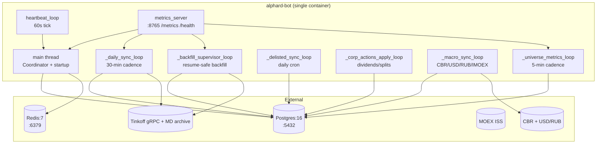
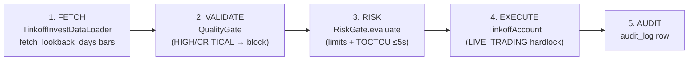
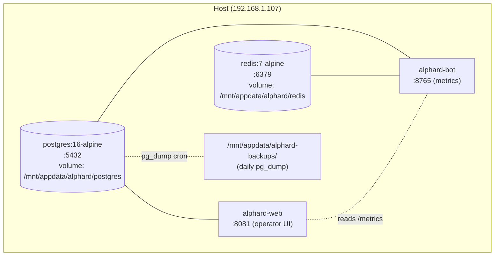

# Alphard — Architecture

**Last updated:** 2026-08-27 (Phase 2.x)
**Audience:** operators, new contributors, integrators
**Status:** canonical. Phase-specific docs (`docs/PHASE1-6-SERVICE-DIAGRAM.md`,
`docs/PHASE2-8-METRICS.md`) are reference material and are explicitly marked
"legacy" from this file.

This document describes the system as it exists at HEAD. For the historical
Phase 1.6 view, see [`docs/PHASE1-6-SERVICE-DIAGRAM.md`](docs/PHASE1-6-SERVICE-DIAGRAM.md)
(legacy — frozen at Phase 1.6, no longer reflects reality).

---

## 1. System overview

Alphard is an autonomous, event-driven multi-agent trading system for MOEX
(Tinkoff Invest API). It runs as a single Docker container
(`alphard-bot`) backed by Postgres (state) and Redis (cache). The
system is **read-heavy by default, write-light by design**: most threads
fetch market data, validate it, and emit metrics; trading actions only
occur after a chain of fail-safe gates that all return "allow".

### 1.1 One-line summary

> Eight cooperating agents orchestrated by a single `Coordinator`,
> running as supervised threads inside one container, exchanging data
> through Postgres and emitting metrics on `:8765` (text-format
> endpoint at `alphard-bot:8765/metrics`; primary reader is
> `alphard-web`, PR #394, on `:8081`). _(Prometheus scraper removed
> in PR #399.)_

### 1.2 Why one container

The agent set is small (~8), the data volume is modest (one
COUNT(*) per minute is the dominant DB cost), and the failure domains
are not separable enough to warrant a multi-service split. A single
container with supervised threads gives us:

- Shared in-process metrics registry (`_metrics_registry` in
  `src/main.py`).
- Trivial startup ordering (no kubernetes / compose choreography).
- One failure domain for ops — if the container is down, the whole
  bot is down; if it's up, everything is up.

We will revisit this only when any of: data volume exceeds 100M
ohlcv_daily rows, multi-region failover becomes a requirement, or
agents start needing independent restart policies.

---

## 2. Component map

### 2.1 Top-level runtime (inside `alphard-bot`)



### 2.2 Active threads and their cadences

| Thread | Cadence | Owner file:line | Restart policy |
|---|---|---|---|
| `main` (Coordinator, event-driven) | event-driven | `src/main.py:171` | n/a (single instance) |
| `_daily_sync_loop` | 30 min | `src/main.py` | supervisor-thread, catches Exception |
| `_backfill_supervisor_loop` | once-on-start, then on-demand | `src/main.py` | resume-safe (3-layer deadlock fix, PR #47/#50) |
| `_delisted_sync_loop` | daily | `src/main.py` | supervisor-thread |
| `_corp_actions_apply_loop` | daily | `src/main.py` | supervisor-thread |
| `_macro_sync_loop` | hourly | `src/main.py` | supervisor-thread |
| `_universe_metrics_loop` | 5 min | `src/main.py:526` | supervisor-thread, gauges go stale on failure |
| `heartbeat_loop` | 60s | `src/main.py` | supervisor-thread |
| `metrics_server` (ThreadingHTTPServer) | continuous | `src/metrics_server.py` | stdlib, no restart policy |

All supervisor threads follow the same pattern:

```python
while not stop_event.is_set():
    try:
        do_work()
    except Exception:
        logger.exception(...)
    sleep_interruptible(period)
```

The loop survives **any** exception without dying; only an OS-level
SIGKILL or a container OOM kill terminates the process.

---

## 3. Data flow — FETCH → VALIDATE → RISK → EXECUTE → AUDIT

The Coordinator pipeline is the only code path that places a trade.
It runs synchronously inside `main.py` after a triggering event
(heartbeat, scheduled job, or external signal). Five stages, all
fail-safe (an exception in any stage blocks the trade):



### 3.1 Stage semantics

| Stage | Code | Output | Block-on-fail |
|---|---|---|---|
| FETCH | `Coordinator._fetch` | `list[Any]` (OHLCV bars) | any exception → `FETCH_ERROR` |
| VALIDATE | `Coordinator._validate` | `bool` | HIGH/CRITICAL → `VALIDATE_CRITICAL` |
| RISK | `Coordinator._risk_check` | `(allowed, violations)` | any violation → `REJECTED_RISK_GATE` |
| TOCTOU | `Coordinator._validate_state_for_execute` | `bool` | elapsed > `toctou_max_seconds` (default 5s) → `TOCTOU_STATE_STALE` |
| EXECUTE | `Coordinator._execute` | `str \| None` | `LIVE_TRADING=false` → `REJECTED_LIVE_TRADING_FALSE` |
| AUDIT | `Coordinator._audit` | `int` (audit_log_id) | none (always) |

### 3.2 Fail-closed invariants

The Coordinator pipeline is intentionally fragile on stages 1-4.
Specifically:

- **VALIDATE must not swallow exceptions.** If `_validate` raises,
  the pipeline blocks with `VALIDATE_EXCEPTION`. The pre-fix
  implementation had `except Exception: return True` which is
  fail-open. See [`src/coordinator.py:408`](src/coordinator.py).
- **RISK must not swallow exceptions.** Same rationale.
- **TOCTOU check is monotonic-clock-based**, not wall-clock, so
  NTP corrections cannot widen the apparent staleness window.

---

## 4. Agents — current state

### 4.1 Implemented and merged

| Agent | Phase | Module | Status |
|---|---|---|---|
| Data | 1.3 → 2.5/2.6 | `src/data/` | ✅ Tinkoff gRPC + MD archive + MOEX ISS + multi-source schema, apply_adjustment (splits+dividends) |
| Risk | 1.1 | `src/risk/gate.py` | ✅ 35 tests, frozen `RiskLimits`/`RiskDecision`, peak-equity drawdown tracker |
| Quality | 1.2 | `src/data/quality/` | ✅ 3 severity tiers (CRITICAL/HIGH/MEDIUM/LOW), `cross_source_smoke` |
| Broker | 1.3 → 1.4 | `src/broker/tinkoff_account.py` | ✅ TinkoffAccount, sandbox switch, `LIVE_TRADING=false` hardlock |
| Coordinator | 1.5 → 2.10 | `src/coordinator.py` | ✅ 5-stage pipeline + TOCTOU + fail-safe, decision log + `fetch_lookback_days` |
| Macro | 2.3 | `src/macro/` | ✅ CBR + USD/RUB + IMOEX fetcher + deterministic regime classifier |
| Metrics | 2.8 | `src/metrics_server.py`, `src/main.py:526` | ✅ stdlib-only `/metrics`, 11 gauges, 6 counters, Phase 2.8 dashboard |
| Backup | 2.9 step 1 | `scripts/backup_database.py` | ✅ daily Postgres dump to `/mnt/appdata/alphard-backups/` |

### 4.2 In progress / planned

| Agent | Phase | Status |
|---|---|---|
| Quant (ML) | 2.4 | ⏳ planned; LightGBM candidate model + walk-forward CV |
| Portfolio (rebalance) | 3 | ⏳ ADR-0006 position sizing landed; full rebalancer in backlog |

---

## 5. Failure modes — fail-open vs fail-closed

This is the section the operator most often needs. Every component
must declare its failure policy so a degraded mode is **predictable**.

| Component | Failure | Policy | Detection |
|---|---|---|---|
| `Coordinator.VALIDATE` (Quality Gate crash) | exception | **fail-CLOSED** (`VALIDATE_EXCEPTION` blocks trade) | `audit_log.risk_violations LIKE 'VALIDATE_%'` |
| `Coordinator.RISK` (RiskGate crash) | exception | **fail-CLOSED** (`RISK_EXCEPTION` blocks) | `audit_log.risk_violations LIKE 'RISK_%'` |
| `Coordinator.TOCTOU` (5s elapsed) | stale | **fail-CLOSED** (`TOCTOU_STATE_STALE`) | `audit_log.risk_violations = 'TOCTOU_STATE_STALE'` |
| `LIVE_TRADING=false` + valid signal | — | **fail-CLOSED** (`REJECTED_LIVE_TRADING_FALSE`) | `broker_status` in audit_log |
| Tinkoff gRPC outage | connection error | **fail-OPEN within layer** (retry with backoff, 3-attempt budget) | supervisor logs |
| MOEX ISS outage | connection error | **fail-OPEN within layer** (skip source, fall back to Tinkoff MD) | `cross_source` smoke |
| Postgres outage | `psycopg.Error` | **fail-CLOSED** (gauges stop updating, supervisor keeps trying) | `alphard_uptime_seconds` stale > 5 min |
| Prometheus scrape failure _(removed, PR #399)_ | — | fail-OPEN (formerly: Grafana panel shows "No data") | dashboard alert _(superseded by `alphard-web` tile, PR #394)_ |
| `_daily_sync_loop` exception | — | **fail-OPEN** (log + sleep, retry next tick) | `alphard_daily_sync_total{result="error"}` |
| `_backfill_supervisor_loop` exception | — | **fail-OPEN with resume** (writes checkpoint, restarts on next tick) | `alphard_backfill_total{result="error"}` |
| `_universe_metrics_loop` exception | — | **fail-OPEN** (gauges stay at last value; reader sees stale) _(Prometheus scraper removed, PR #399; current reader is `alphard-web`, PR #394)_ | `alphard_*_total` no delta |
| RiskGate limits object mutation post-construction | `object.__setattr__` blocked | **fail-CLOSED** (`FrozenInstanceError`) | unit test |

Rule of thumb: anything that could move money is fail-CLOSED.
Anything that affects only observability is fail-OPEN with stale
signaling.

---

## 6. Data stores

### 6.1 Postgres

Volume at HEAD: ~50 MB on local-dev path (1 ticker, 5y of OHLCV). At
production scale (200 tickers × 9y × 3 sources) ≈ 200 MB. No
sharding needed; VACUUM ANALYZE every 7 days is sufficient.

| Table | Owner | Purpose |
|---|---|---|
| `ticker_universe` | `scripts/backfill_history_md.py` | All tickers ever seen, with `backfill_complete` flag |
| `ohlcv_daily` | Data Agent + backfill | OHLCV bars per (ticker, ts, source) |
| `audit_log` | `Coordinator._audit` | One row per `run_once()` |
| `risk_state` | RiskGate | Last N `RiskDecision` rows |
| `macro_state` | Macro Agent | CBR key rate, USD/RUB, IMOEX time-series |
| `delisted_universe` | `_delisted_sync_loop` | MOEX ISS delisted tickers |

### 6.2 Redis

Used for token-bucket rate limiting on Tinkoff API calls (per-token,
per-second). On Redis outage the Data Agent falls back to in-process
token bucket (`src/data/token_bucket.py`); correctness preserved,
throughput degraded.

### 6.3 Tinkoff MD archive (read-only)

Pre-candles historical data via gRPC. Covers the full 9-year history.
This is the **only** source that can fill the full listed_at..today
range; broker gRPC and MOEX ISS both cap at 1825 days. Per-ticker
backfill completion is checked via `_is_complete()` in
`scripts/backfill_history_md.py`.

---

## 7. Deployment topology

### 7.1 Container layout



_(Post-#399: the Prometheus and Grafana nodes were removed; the
metrics read path is `alphard-web` (PR #394) on `:8081` reading from
`alphard-bot:8765/metrics` and from the Postgres-resident state.)_

### 7.2 Port map

| Port | Service | Notes |
|---|---|---|
| 8080 | alphard-bot health | legacy, may be removed in Phase 3 |
| 8081 | `alphard-web` | operator UI (PR #394); bearer-token gated per PR #406 / #411 |
| 8765 | alphard-bot /metrics | reader endpoint (text-format; `alphard-web` is the active consumer post-#399) |

_(Ports 9090 (Prometheus) and 3300 (Grafana) removed in PR #399; see
§7.1 for the post-removal layout.)_

### 7.3 Bind-mounts (repo-controlled)

| Source | Container path | Service | Notes |
|---|---|---|---|
| `./backups/` | `/var/backups/` | alphard-bot | bind-mounted for backup staging |

_(The two bind-mount rows from the deleted Grafana / Prometheus
directories are dropped — see git history pre-PR #399 for the
original rows; the directories themselves were removed in PR #399.)_

### 7.4 Env sources

The entrypoint sources env files in this order (first-existing wins):

1. `$ENV_FILE` (explicit override, used by Portainer StackUpdate)
2. `/run/secrets/alphard.env` (Docker secrets)
3. `/root/.env` (compose bind-mount, dev host)
4. `/tmp/alphard.env` (operator one-off fallback)

The "first-existing wins" pattern is implemented in
[`docker/entrypoint.sh`](docker/entrypoint.sh) and is the regression
target of issue #295.

---

## 8. Extension points

### 8.1 Adding a new agent (3rd-party)

The Coordinator pipeline is the only path that places a trade. New
agents that read data (e.g. quant signals, sentiment) MUST NOT
short-circuit around `Coordinator.run_once()` — they should emit
signals that the Coordinator consumes via `_fetch()` or a future
event-driven extension.

### 8.2 Adding a new data source

1. Implement a loader class with `fetch_ohlcv(ticker, start, end) -> list[Bar]`.
2. Register it in `scripts/cross_source_smoke.py` so the cross-source
   consistency check covers it.
3. Add a fallback chain entry in `scripts/backfill_history_md.py`
   (`zip → broker → moex → <your-source>` order).
4. Add unit tests in `tests/`; coverage gate ≥95%.

### 8.3 Adding a new risk limit

1. Add a field to `RiskLimits` (`src/risk/gate.py`). The Pydantic
   model is **frozen**; any post-construction mutation is rejected.
2. Add the violation string to the check in `RiskGate.evaluate()`.
3. Update `tests/test_risk_gate.py` with positive + negative cases.
4. Update `API.md` (`RiskLimits` field reference).

---

## 9. References (legacy docs marked explicitly)

- [`docs/PHASE1-6-SERVICE-DIAGRAM.md`](docs/PHASE1-6-SERVICE-DIAGRAM.md) —
  **LEGACY**, frozen at Phase 1.6. Kept for migration history.
- [`docs/PHASE2-8-METRICS.md`](docs/PHASE2-8-METRICS.md) —
  Phase 2.8 implementation details (counters, gauges, scraper config).
- [`docs/PHASE2-ROADMAP.md`](docs/PHASE2-ROADMAP.md) — backlog,
  not architecture.
- [`docs/RUNBOOK.md`](docs/RUNBOOK.md) — operational procedures
  (incident response, restart, backup restore).
- [`docs/SECURITY.md`](docs/SECURITY.md) — threat model.
- [`docs/DEPLOY-ENV.md`](docs/DEPLOY-ENV.md) — env-var catalogue.
- [`docs/POSITION-SIZING.md`](docs/POSITION-SIZING.md) — single-concern.
- [`docs/QUICKSTART.md`](docs/QUICKSTART.md) — first-shot bring-up.
- [`docs/decisions/0006-position-sizing.md`](docs/decisions/0006-position-sizing.md) — ADR-0006.
- [`docs/decisions/0007-rebalance-scheduler.md`](docs/decisions/0007-rebalance-scheduler.md) — ADR-0007.

---

## 10. What this doc does NOT cover

- **Per-class API contracts** → see `API.md` (issue #286).
- **Pytest strategy + skip policy** → see `TESTING.md` (issue #287).
- **Known failure modes + fix index** → see `TROUBLESHOOTING.md` (issue #288).
- **CHANGELOG** → see `CHANGELOG.md` (issue #289).