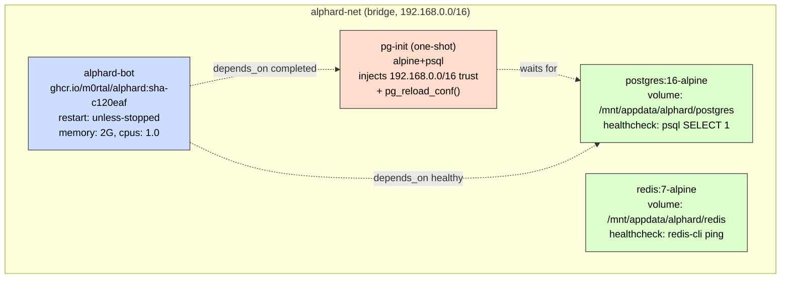
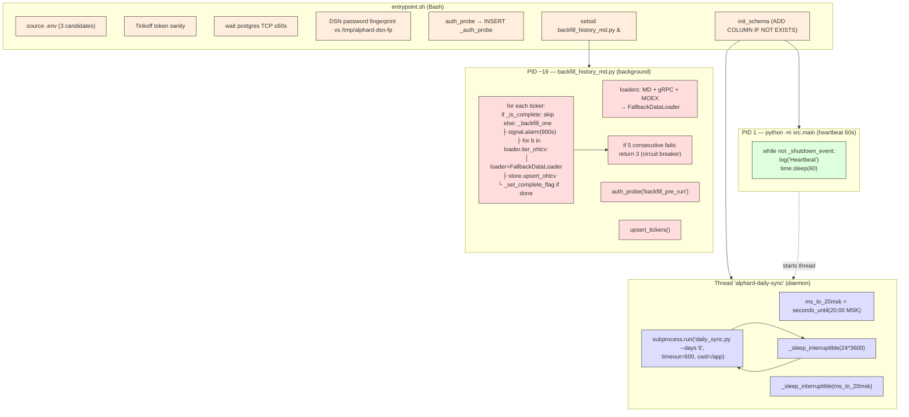
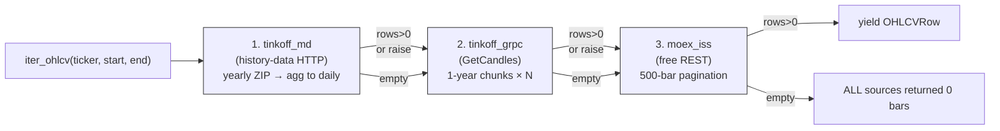
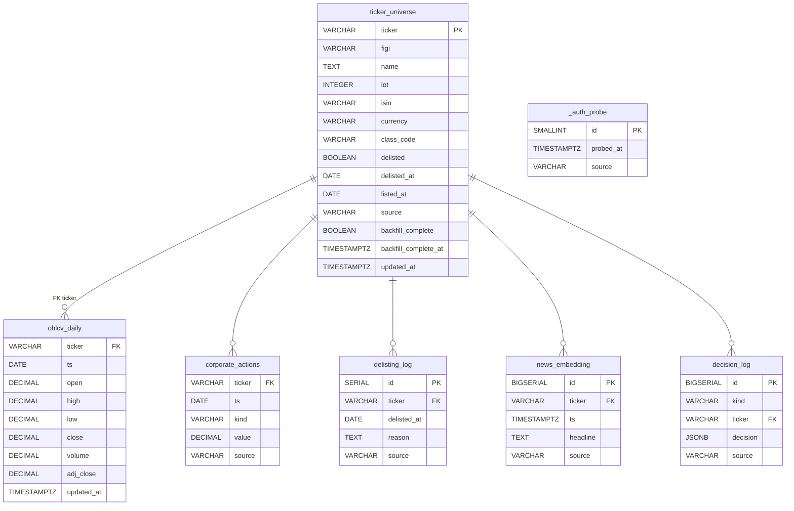
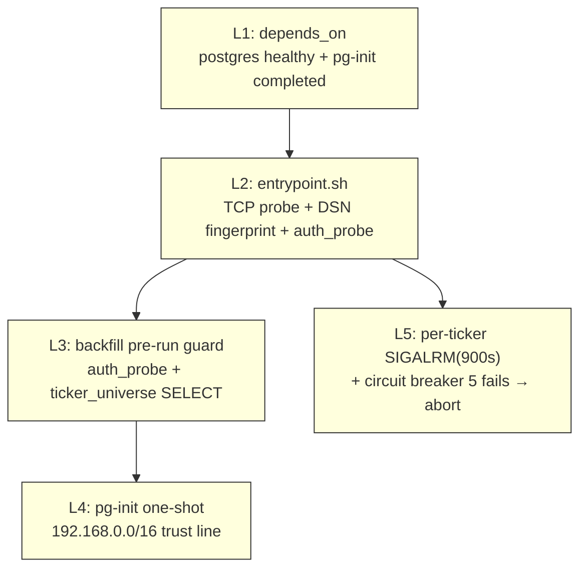
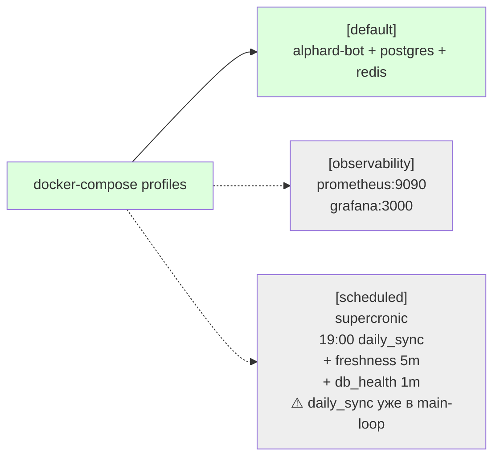

# Alphard service — current state (Phase 1.6)

> ⚠️ **LEGACY DOCUMENT** — Snapshot from Phase 1.6 (before Macro Agent,
> before observability metrics, before Postgres audit). The diagrams in
> this file reflect Phase 1.6 topology only.
>
> Current architecture (Phase 2.x with Macro Agent, RiskGate, observability
> stack):
>
> - [`docs/ARCHITECTURE.md`](ARCHITECTURE.md) — canonical current architecture
> - [`docs/PHASE2-8-METRICS.md`](PHASE2-8-METRICS.md) — current runtime diagrams
> - [`DOCS-INDEX.md`](../DOCS-INDEX.md) — top-level navigation, including the legacy table
>
> Do **not** make decisions based on this file. Preserved for audit trail only.
> See issue #292.

---

Three diagrams: stack, runtime, fallback chain. Render in any mermaid viewer (GitHub, VSCode, mermaid.live).

## 1. Service stack

## 2. Runtime — what's running inside alphard-bot

## 3. Fallback chain (one ticker fetch)

## 4. Schedule (MSK wall-clock)

```mermaid
gantt
    title Daily pipeline (anchored to 20:00 MSK)
    dateFormat HH:mm
    axisFormat %H:%M
    section Container
    Heartbeat 60s    :active, h1, 00:00, 24h
    Backfill (setsid)  :active, b1, 00:00, 24h
    section Markets
    MOEX daily close :milestone, m1, 18:40, 0m
    daily_sync 5d pull :crit, s1, 20:00, 5m
```

## 5. Postgres schema (7 tables)

## 6. Defense-in-depth (5 layers)

## 7. Profiles (lazy, not deployed)

